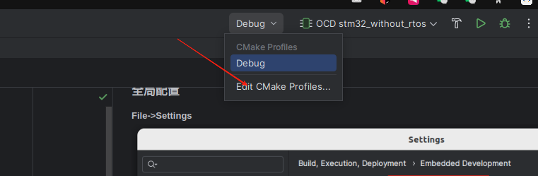
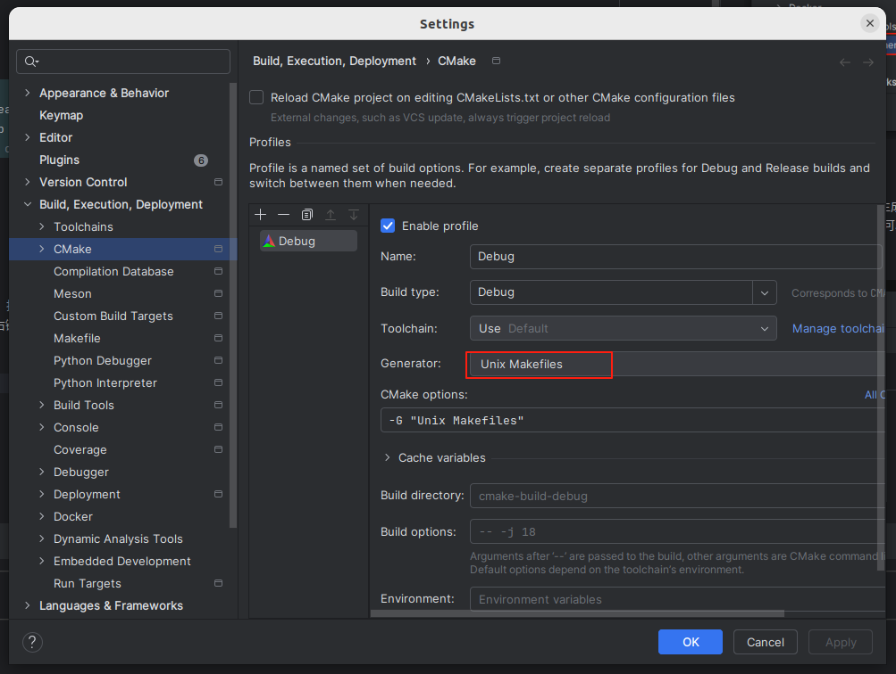
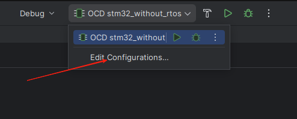
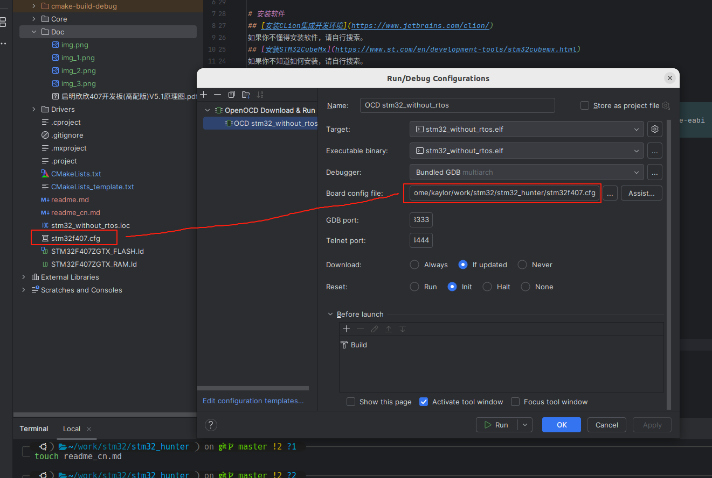

---

中文 | [English](README.md)

---

本教程适用于于Ubuntu22.04（原则上ubuntu24.04也可以使用，但未测试过），Windows事实上也能使用，但是配置会变得相当麻烦，不建议使用。

---

# 安装软件
## [安装CLion集成开发环境](https://www.jetbrains.com/clion/)
如果你不懂得安装软件，请自行搜索。
## [安装STM32CubeMx](https://www.st.com/en/development-tools/stm32cubemx.html)
如果你不知道如何安装，请自行搜索。

## 安装编译器，依赖库以及常用工具
```bash
sudo apt update
sudo apt install -y gcc-arm-none-eabi libnewlib-dev libstdc++-arm-none-eabi-newlib libnewlib-arm-none-eabi 
sudo apt install -y cmake make gdb openocd
sudo apt install -y git picocom # optional
```
# 配置
## 配置CLion
### 全局配置  
**File->Settings**

### 项目配置
打开项目的时候，CLion会生成一个配置向导，按照提示进行配置。  
如果你没有使用配置向导，可以在文件窗口中右键点击 **CMakeLists_template.txt** 文件，选择 "Update CMake ..."

#### 编译配置
  
  

#### 运行配置


```
source [find interface/stlink.cfg]

transport select hla_swd

# increase working area to 64KB
set WORKAREASIZE 0x10000

source [find target/stm32f4x.cfg]

reset_config none
```
注意运行配置文件的内容, 文件中reset_config none是因为使用的SWD调试模式没有接硬件复位引脚，所以设置为none


